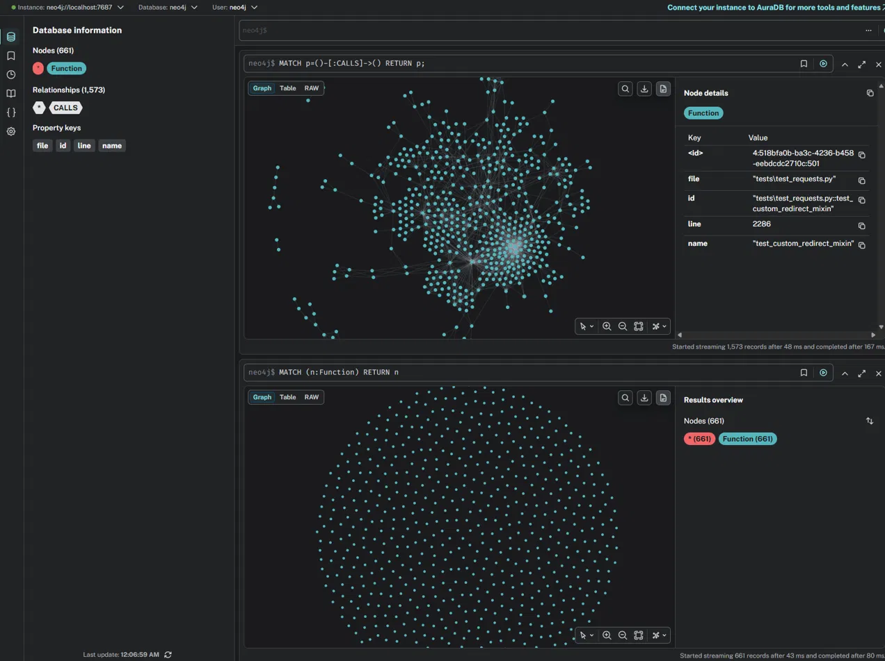
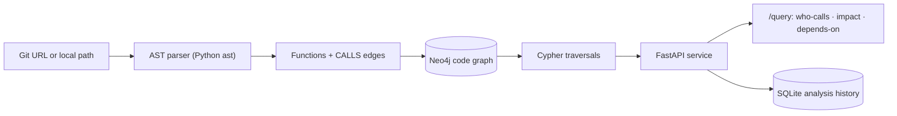

# CodeGraph — Codebase Q&A & Impact Map

> Build a queryable **code graph** of any Python repository and answer the two questions engineers actually fear before touching unfamiliar code:
> **"Who calls this function?"** and **"What breaks if I change it?"**

CodeGraph parses a repository into a graph of functions and their call relationships, stores it in **Neo4j**, and exposes it through a clean **FastAPI** service. Unlike search- or embedding-based tools, it answers *structural* questions — because dependencies are **connections**, not text similarities.


*The full call graph of `psf/requests` — every function and `CALLS` relationship.*

---

## Why this exists

AI coding tools are great at "what does this code *mean*." They're weak at the structural question that decides whether a change is safe: **blast radius.** Before you modify a function in a large or unfamiliar codebase, you need to know everything that transitively depends on it.

CodeGraph answers that directly by modeling the codebase as a graph and traversing real call relationships — so "what does changing `send` affect?" is a single graph query, not a guess.

---

## Demo — analyzing `psf/requests`

Onboarded straight from a GitHub URL:

```json
POST /onboard
{ "repo_path": "https://github.com/psf/requests" }

→ {
  "repo": "https://github.com/psf/requests",
  "functions_indexed": 711,
  "call_edges_indexed": 1548
}
```

A focused view of the graph (readable subgraph):


*Zoomed in: a cluster of functions and their `CALLS` edges.*

### Who calls a function?

```
GET /query/who-calls?name=request
```
```json
{
  "target": "request",
  "callers": [
    { "name": "get",   "file": "src/requests/api.py" },
    { "name": "post",  "file": "src/requests/api.py" },
    { "name": "head",  "file": "src/requests/sessions.py" },
    { "name": "patch", "file": "src/requests/sessions.py" }
  ]
}
```

### What breaks if I change it? (transitive impact)

```
GET /query/impact?name=send&depth=3
```
```json
{
  "target": "send",
  "depth": 3,
  "impacted_by_change": [
    { "name": "handle_401",       "file": "src/requests/auth.py" },
    { "name": "response_handler", "file": "tests/test_requests.py" }
  ]
}
```

### What does it depend on? (transitive, with hop distance)

```
GET /query/depends-on?name=request&depth=3
```
```json
{
  "target": "request",
  "depth": 3,
  "depends_on": [
    { "name": "merge_environment_settings", "file": "src/requests/sessions.py", "hop": 1 },
    { "name": "prepare_request",            "file": "src/requests/sessions.py", "hop": 1 },
    { "name": "send",                       "file": "src/requests/adapters.py", "hop": 1 }
  ]
}
```

`hop` is the shortest call-distance from the target — closer dependencies are higher-risk.

---

## How it works



1. **Parse** — Python's built-in `ast` walks every `.py` file, extracting function definitions and the calls inside them.
2. **Resolve** — call names are matched to function definitions to produce `CALLS` edges; each function gets a stable id (`path::name`).
3. **Store** — functions and edges are written into **Neo4j** with idempotent `MERGE` (re-onboarding updates rather than duplicates).
4. **Query** — `who-calls` / `impact` / `depends-on` are Cypher traversals; impact and depends-on use variable-length paths (`[:CALLS*1..N]`) for transitive reach.
5. **Remember** — every onboard and query is logged with a timestamp to a **SQLite** analysis history, queryable at `/memory/history`.

---

## API reference

| Method | Route | Purpose |
|--------|-------|---------|
| `POST` | `/onboard` | Index a repo (local path **or** public git URL) into the graph |
| `GET`  | `/query/who-calls?name=` | Direct callers of a function |
| `GET`  | `/query/impact?name=&depth=` | Everything that transitively calls it ("what breaks") |
| `GET`  | `/query/depends-on?name=&depth=` | Everything it transitively calls, with hop distance |
| `GET`  | `/memory/history?limit=` | Log of past onboards and queries |
| `GET`  | `/health` | Liveness check |

Interactive docs (Swagger UI) are auto-generated at **`/docs`**.

---

## Tech stack

- **Python** + **FastAPI** — the service and clean route layer
- **Neo4j** — persistent code graph, queried with Cypher
- **Python `ast`** — zero-dependency parsing (multi-language via tree-sitter is on the roadmap)
- **SQLite** — analysis-history memory
- **Docker / docker-compose** — one-command Neo4j + API stack

---

## Quick start

> Prerequisites: Docker, Python 3.12+, and `git`.

```bash
# 1. Clone
git clone https://github.com/amitesh1234/codegraph-basic.git
cd codegraph-basic

# 2. Start Neo4j (Browser at http://localhost:7474, user: neo4j / pass: password)
docker compose up -d neo4j

# 3. Run the API
python -m venv .venv
source .venv/bin/activate          # Windows: .venv\Scripts\activate
pip install -r requirements.txt
uvicorn app.main:app --reload

# 4. Open the docs and onboard a repo
#    http://localhost:8000/docs
curl -X POST http://localhost:8000/onboard \
  -H "Content-Type: application/json" \
  -d '{"repo_path": "https://github.com/psf/requests"}'
```

See **[DEPLOYMENT.md](DEPLOYMENT.md)** for the full-Docker stack and cloud (Neo4j AuraDB) deployment.

---

## Project structure

```
codegraph-basic/
├── docker-compose.yml      # Neo4j + API services
├── Dockerfile              # API image
├── requirements.txt
├── app/
│   ├── main.py             # FastAPI app + lifespan + routers
│   ├── db.py               # Neo4j connection + run_query helper
│   ├── parser.py           # AST → functions + call edges
│   ├── graph_store.py      # write graph into Neo4j (MERGE/UNWIND)
│   ├── memory.py           # SQLite analysis history
│   └── routers/
│       ├── onboarding.py   # POST /onboard
│       ├── queries.py      # GET /query/...
│       └── memory.py       # GET /memory/history
└── DEPLOYMENT.md
```

---

## Known limitations

This is a **static, best-effort** call graph — honest about what it does and doesn't capture:

- **Name-based resolution.** Calls are matched by function name, so a call to `send` links to *every* `send` in the repo (e.g. both `src/requests/adapters.py` and `tests/test_requests.py`). It does not resolve types or imports to pick the exact target.
- **Dynamic dispatch isn't captured** — reflection, `getattr`, and runtime-resolved calls are invisible to static analysis (this is formally undecidable in general).
- **Python only** for now.

These are the expected trade-offs of fast static analysis; semantic resolution is the next step.

---

## Roadmap

- **Multi-language** extraction via **tree-sitter** / **Joern** (JavaScript, Java, and large legacy codebases)
- **Semantic call resolution** (SCIP / LSP) to replace name-based matching
- **Document onboarding** — ingest PRDs / Confluence / design docs alongside code
- **Scoped-edit guardrail** — use the graph to constrain AI agents to minimal, traceable changes

---

## License

MIT